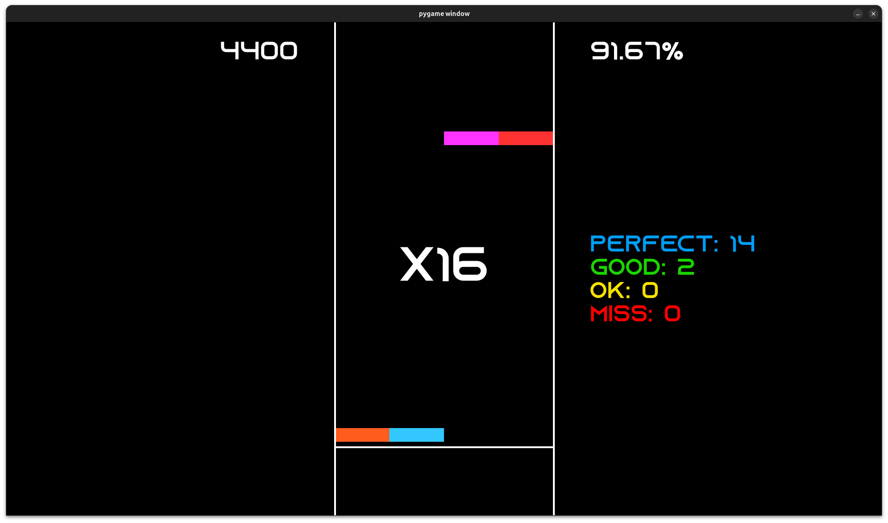
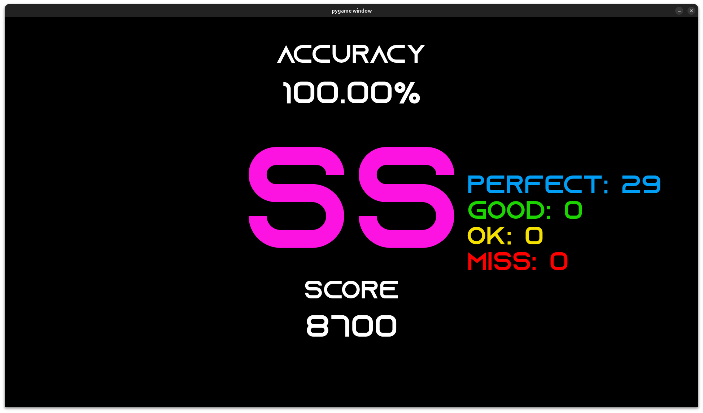

# PyMania
a simple version of osu!mania made in PyGame!

## Info
PyMania is a remake of osu!mania made in PyGame!  
it only supports 4k maps.  
you can import maps from osu, and play them!  
it's also what i like to call JANKY AF!!! ^_^ WOOOOOOOOOO!

it comes with 3 main files:
- pymania.py ~ contains the actual game, and can be run with a command (read below)
- mapselector.py ~ opens up a nice GUI so you can easily load maps to play ^_^
- parser.py ~ don't run this, it's only for making pymania read maps

there's also a few maps that come with the game, so you can try right away!
**(please tell me if there's an issue with me including them lmao)**

PyMania was originally started for a school project, but will hopefully continue to recieve updates!  
i hope you enjoy looking through it! (maybe enough to contribute...?)  

IMAGES!

---

## How to Play
there are 2 ways!  

### 1
run mapselector.py
find your desired map in the maps/ directory, and choose your selected .osu file  
also choose the audio file (this is planned to be removed, be patient :D)  
click the run button!  

### 2
you can also open maps directly in the terminal by using:  
`python3 pymania.py [--audioPath AUDIOPATH] [--mapPath MAPPATH]`  

default keybinds are DFJK  

---

## Installing Maps
**IMPORTANT! ALL MAP FILES MUST BE OSU FILE FORMAT V128!**  
**TO CONVERT, OPEN IN OSU!LAZER AND EXPORT**  
**(support for older file formats is planned. sorry for the inconvenience ;( )**  

download your map from the osu website  
change ".osz" to ".zip"  
create a new folder in the maps/ directory, and copy all the map files into it  
done! now you can load!  

---

## Known Issues
- hold note releases are not judged (this is intentional for now)  
- there is no delay between PyMania opening, and the song starting.  
    this often leads to instant misses upon load  
- performance issues on high level maps  

thank you for checking this out! ^_^  
